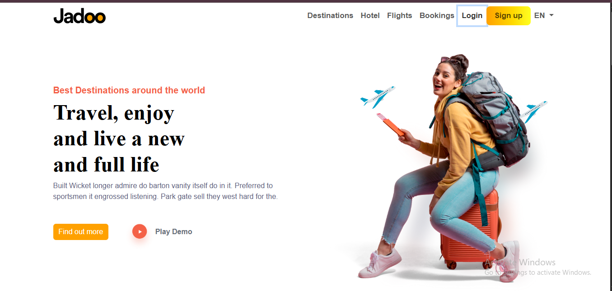

# 🌍 Jadoo Travel Landing Page

A fully responsive travel-themed landing page built with **Bootstrap 5**.  
This project was developed as part of a **Mini Hackathon** after completing my **Bootstrap 5 course**, under the mentorship of **Sheikh Hafsa**.

---

## 📌 Project Overview

- **Project Title:** Jadoo Travel Landing Page  
- **Type:** Mini Hackathon Final Project  
- **Tech Stack:** HTML5, CSS3, Bootstrap 5  
- **Mentor:** Sheikh Hafsa  
- **Responsive:** ✅ Fully responsive across all devices

---

## 🎯 Features

- ✅ Clean and modern UI with travel-based theme  
- ✅ Responsive navigation bar with menu links: Destinations, Hotels, Flights, Bookings  
- ✅ Login & Sign Up buttons with call-to-action  
- ✅ Eye-catching hero section with headline:  
  _"Travel, enjoy and live a new and full life"_  
- ✅ Visual elements: Airplane icons, travel image, bright color scheme  
- ✅ Built entirely using Bootstrap 5 classes and components  
- ✅ Mobile-first design approach

---

## 💡 Learning Highlights

- Mastered Bootstrap Grid System and Utilities  
- Practiced layout structuring using containers, rows, and columns  
- Gained hands-on experience with responsive design  
- Worked on typography, spacing, and image placement for real-world UI  

---

## 📸 Project Preview

## ✨ Special Thanks

Gratitude to **Sheikh Hafsa** for the guidance and support during the Bootstrap 5 learning journey and this final project!

--

